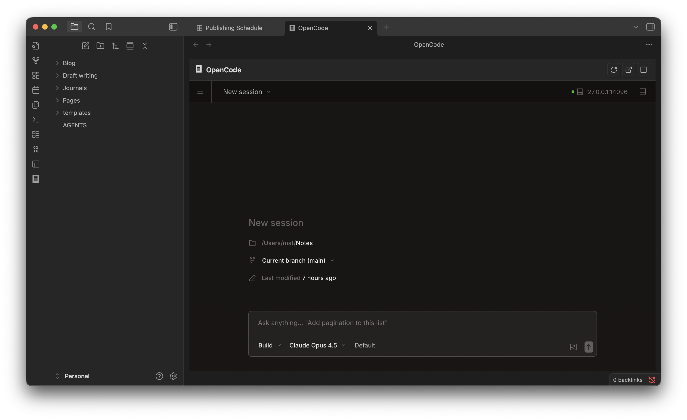
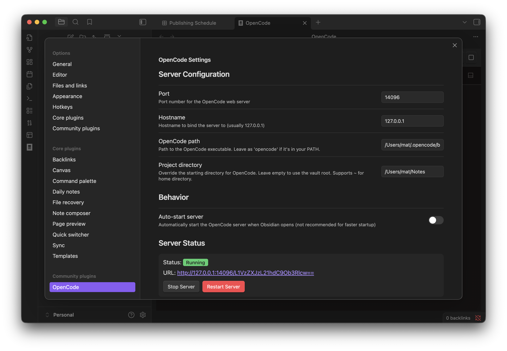

# OpenCode plugin for Obsidian

Give your notes AI capability by embedding Opencode [OpenCode](https://opencode.ai) AI assistant directly in Obsidian:

**Use cases:**
- Summarize and distill long-form content
- Draft, edit, and refine your writing
- Query and explore your knowledge base
- Generate outlines and structured notes

This plugin uses OpenCode's web view that can be embedded directly into Obsidian window. Usually similar plugins would use the ACP protocol, but I want to see how how much is possible without having to implement (and manage) a custom chat UI - I want the full power of OpenCode in my Obsidian.

_Note: plugin author is not afiliated with OpenCode or Obsidian - this is a 3rd party software._

## Requirements

- Desktop only (uses Node.js child processes)
- [OpenCode CLI](https://opencode.ai) installed 
- [Bun](https://bun.sh) installed

## Installation

1. Clone to `.obsidian/plugins/obsidian-opencode` subdirectory under your vault's root
2. Run `bun install && bun run build`
3. Enable in Obsidian Settings > Community plugins
4. Add AGENTS.md to the workspace root, use it to explain the structure

## Usage

- Click the terminal icon in the ribbon, or
- `Cmd/Ctrl+Shift+O` to toggle the panel
- Server starts automatically when you open the panel

## Context injection (experimental)

This plugin can automatically inject context to the running OC instance: list of open notes and currently selected text.

It can be configured form the plugin settings.

Currently, this is work-in-progress feature with some limitations:
- It won't work when creating new session from OC interface.

## Settings

